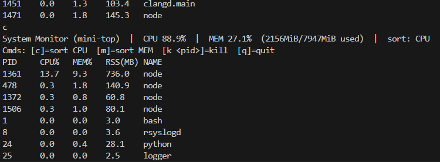
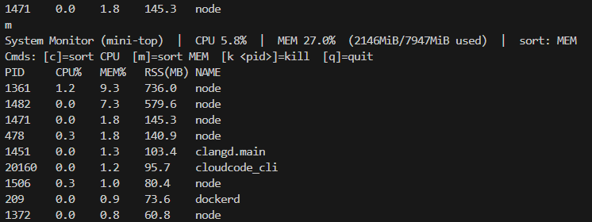
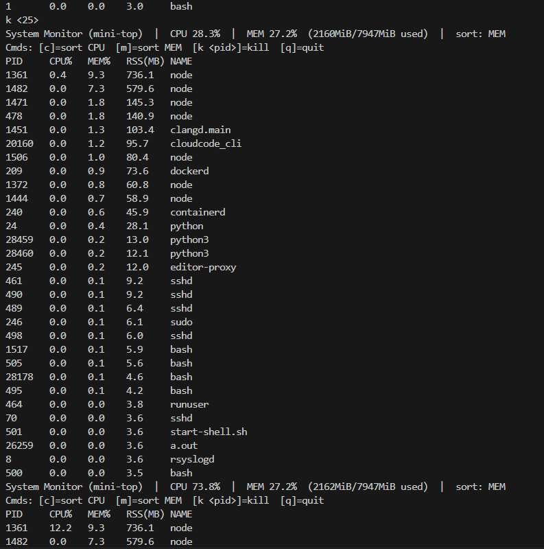
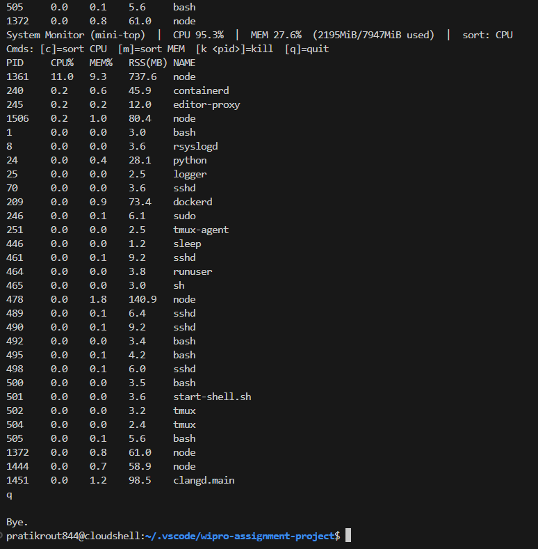

# 🖥️ System Monitor Tool (mini-top)
### *Capstone Project - Assignment 3 (LSP)*

---

## 📘 1. Introduction

The **System Monitor Tool** is a C++ terminal-based application designed to display **real-time information** about system performance.  
It tracks **CPU usage, memory utilization, and active processes**, similar to the Linux `top` command.  

This project demonstrates practical use of **system programming**, **file handling**, and **process management** in Linux using **system calls and the `/proc` filesystem**.

---

## 🧩 2. Project Explanation

The tool continuously fetches and updates system data, showing:
- List of all active processes (PID, Name, CPU%, MEM%)
- Total CPU and Memory utilization
- Sorting functionality (by CPU or Memory)
- Process termination (kill by PID)
- Real-time automatic data refresh

### 🧠 Key Learning Outcomes:
- Reading process and system data from `/proc`
- Implementing CPU and Memory usage calculations
- Handling signals to terminate processes
- Building interactive command-line UI in C++

---

## ⚙️ 3. Requirements

### 🧭 Software:
- **Operating System:** Linux (Ubuntu/Debian recommended)
- **Compiler:** GCC / G++ version 9.0 or higher
- **Libraries:** Standard C++ STL

### 🗃️ Hardware:
- Minimum 4 GB RAM  
- Any dual-core CPU or higher  

### 📦 Optional (for GitHub & Documentation):
- Git
- VS Code or any C++ IDE

---

## 📂 4. Project Structure

```
System-Monitor-Tool/
│
├── src/
│   └── system_monitor.cpp       # Main source code
│
├── screenshots/
│   ├── monitor_run.png
│   ├── monitor_cpu_sort.png
│   └── monitor_mem_sort.png
│
├── build/                       # Compiled executables
│
├── README.md                    # Project documentation
├── .gitignore                   # Ignore unnecessary files

```


## 🧰 5. How to Run the Project

### 🪄 Step 1: Compile the Code
```bash
g++ src/system_monitor.cpp -o build/monitor
```

### 🪄 Step 2: Run the Tool
```bash
./build/monitor
```

### 🪄 Step 3: Use Interactive Commands

| Command | Description |
|----------|-------------|
| `c` | Sort by CPU usage |
| `m` | Sort by Memory usage |
| `k <pid>` | Kill a process by PID |
| `q` | Quit the tool |

---

## 🧮 6. Sample Output

### 🖼️ Running the System Monitor
```
System Monitor (mini-top) | CPU 13.8% | MEM 25.8% (2050MiB/7947MiB used)
-------------------------------------------------------------------
PID    CPU%   MEM%   RSS(MB)   NAME
1361   1.0    8.0    632.9     node
478    0.5    1.8    140.5     node
1506   0.2    1.0     79.2     node
...
```

### 🖼️ Screenshots

### 🟢 Running Monitor


---

### ⚙️ Feature Previews
| CPU Sort | Memory Sort |
|-----------|--------------|
|  |  |

| Kill Process | Exit |
|---------------|------|
|  |  |


## 🧠 8. Results & Observations

- Successfully monitored **real-time CPU and memory usage**.
- Implemented **interactive keyboard control** within a terminal application.
- Achieved **process management** (sorting and killing).
- The project mimics basic functionality of the Linux `top` command using pure C++.

---

## 🏁 9. Conclusion

The **System Monitor Tool** provides an efficient way to understand how operating systems manage resources and processes.  
It reinforces concepts of **process scheduling**, **system calls**, **file handling**, and **real-time data refresh** in a Linux environment.  

This project demonstrates practical **system-level programming skills** and builds a strong foundation for advanced OS and systems development projects.

---

## 👨‍💻 10. Author

**Pratik Rout**  
Final Year – Computer Science and Information Technology  


---

## 📜 11. License

This project is licensed under the **MIT License**.  
You’re free to use and modify this project with proper credit.

```
MIT License  
Copyright (c) 2025 Pratik Rout
```
